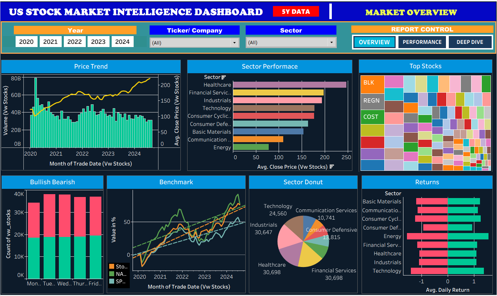
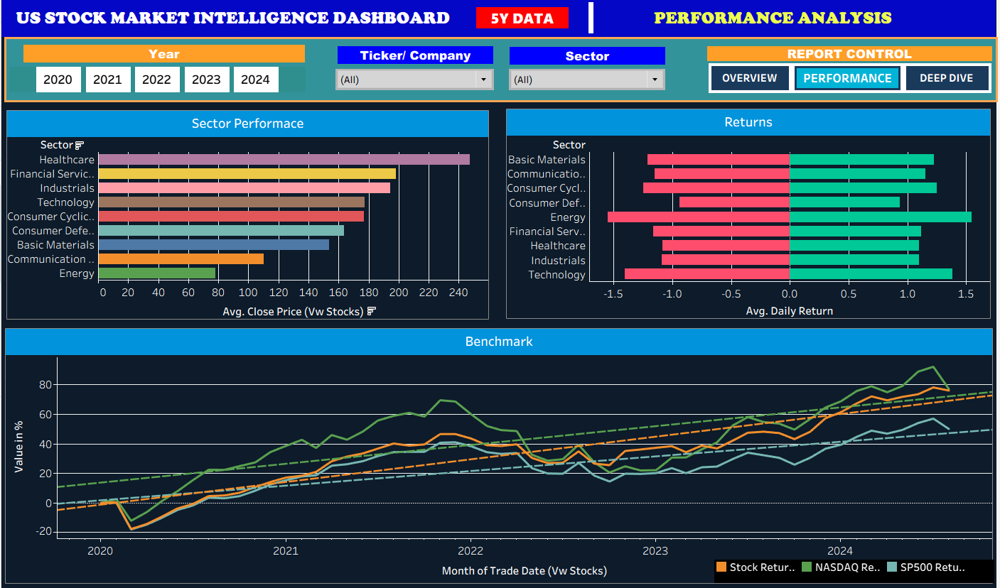
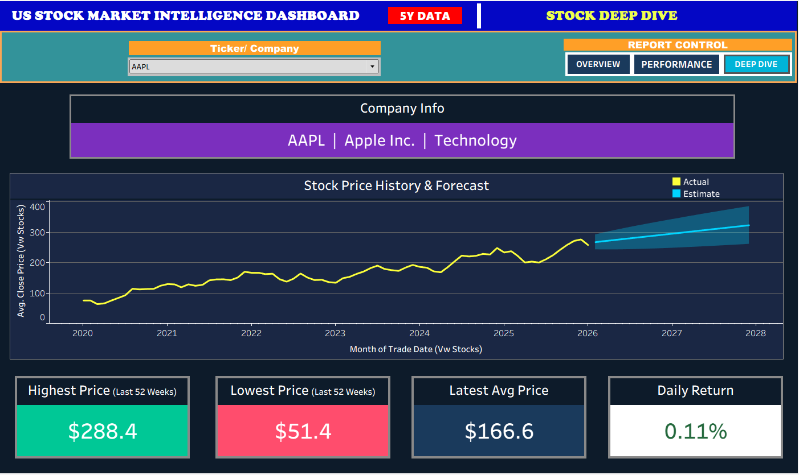

# 📊 US Stock Market Intelligence Dashboard

## 🔴 Live Dashboard
[👉 Click below to view live dashboard]
(https://public.tableau.com/app/profile/mishane.peirispulle/viz/USStockmarketanalysisProject/MarketOverview)

---

## 🎯 Project Overview
An end-to-end stock market analytics dashboard tracking
120 S&P 500 companies across 5 years (2020–2024).

**Pipeline:** Kaggle → MySQL 8.0 → Tableau Public

---

## 🛠️ Tools & Technologies
| Tool | Purpose |
|------|---------|
| MySQL 8.0 | Database, storage & cleansing |
| MySQL Workbench | SQL queries & management |
| Tableau Public | Dashboard & visualizations |
| Kaggle | Raw dataset source |

---

## 📁 Dataset
- **Source:** Kaggle — US Stock Market OHLCV
- **Size:** 184,138 rows × 16 columns
- **Period:** January 2020 – September 2024
- **Stocks:** 120 S&P 500 companies
- **Sectors:** 9 sectors

---

## 📊 Dashboard Pages

### Page 1 — Market Overview
- Price Trend (combo line + volume bars)
- Sector Performance horizontal bars
- Top 10 Stocks treemap
- Bullish vs Bearish day analysis
- Benchmark comparison (Stock vs S&P500 vs NASDAQ)
- Sector donut chart
- Returns by sector

### Page 2 — Performance Analysis
- Sector Performance deep dive
- Returns by sector analysis
- Benchmark % return comparison

### Page 3 — Stock Deep Dive
- Individual stock price history + forecast
- Company information card
- 52-Week High & Low KPI cards
- Latest price & daily return metrics

---

## 🔑 Key Insights
1. **NASDAQ** outperformed S&P 500 by ~40% over 5 years
2. **Healthcare** had highest average stock price ($248)
3. **63%** of all trading days were Bullish
4. **Technology** had highest trading volume of all sectors
5. **Financial Services** showed strongest average returns

---

## 🗃️ SQL Pipeline
**Database:** `stock_dashboard` (MySQL 8.0)

**Tables:**
| Table | Rows | Description |
|-------|------|-------------|
| `stock_prices` | 184,138 | Daily OHLCV stock data |
| `sp500` | 353K | S&P 500 intraday data |
| `nasdaq100` | 329K | NASDAQ 100 intraday data |

**Views:**
| View | Description |
|------|-------------|
| `vw_stocks` | Clean stock data for Tableau |
| `vw_sp500_daily` | Daily aggregated S&P 500 |
| `vw_nasdaq_daily` | Daily aggregated NASDAQ |

## 📸 Dashboard Screenshots

### Market Overview

### Performance Analysis

### Stock Deep Dive

---

## 📂 Repository Structure

| File | Description |
|------|-------------|
| `01_create_tables.sql` | MySQL database and table creation |
| `02_load_data.sql` | Load CSV data into MySQL |
| `03_views.sql` | Clean views for Tableau |
| `page1_market_overview.png` | Market Overview dashboard screenshot |
| `page2_performance.png` | Performance Analysis screenshot |
| `page3_deep_dive.png` | Stock Deep Dive screenshot |
| `README.md` | Project documentation |

---

## 👤 Author
**Mishane Peirispulle**
- 💼 Financial Data Analyst
- 📧 mishane_peiris@yahoo.com
- 🔗 [LinkedIn Profile]https://www.linkedin.com/in/mishane-nisila/
- 🔗 [Tableau Public Profile]https://public.tableau.com/app/profile/mishane.peirispulle/vizzes

